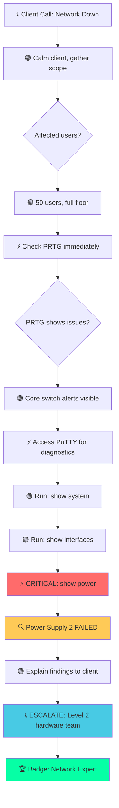
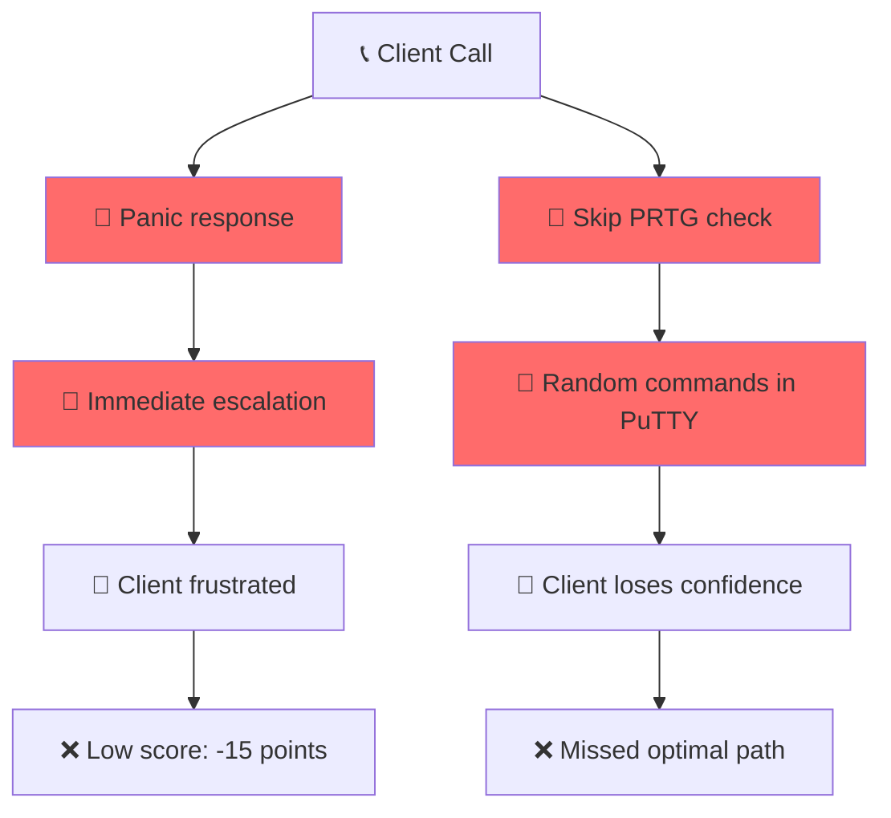
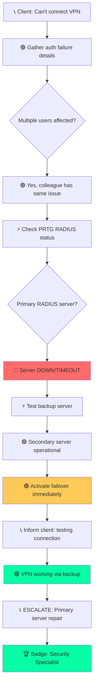
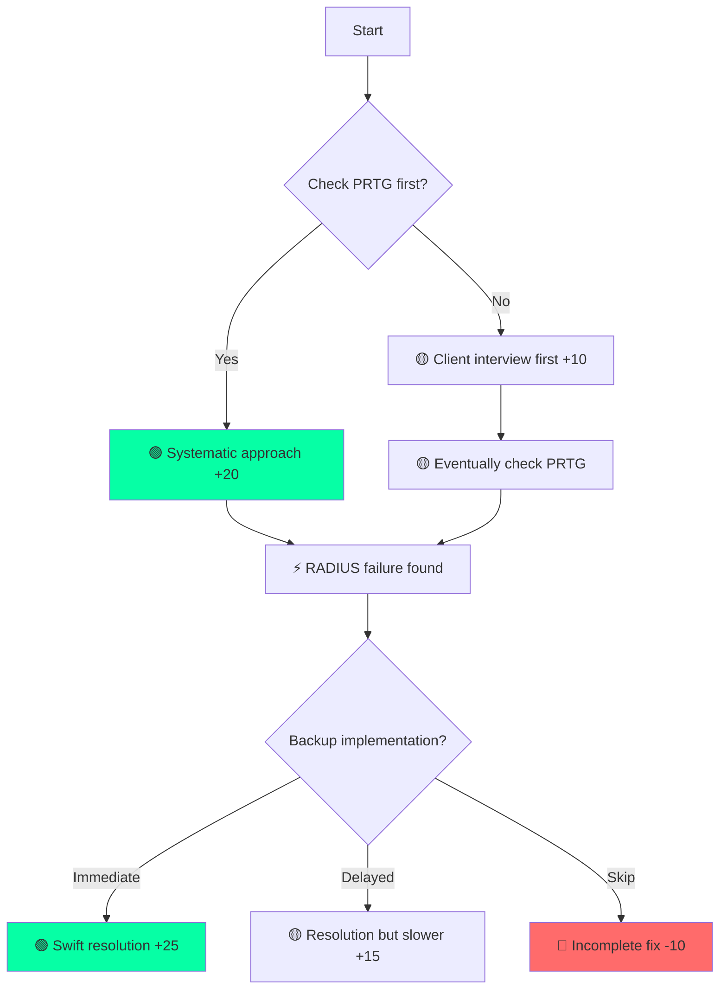
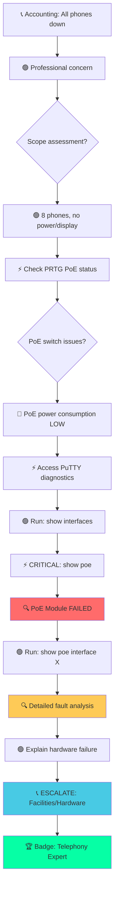
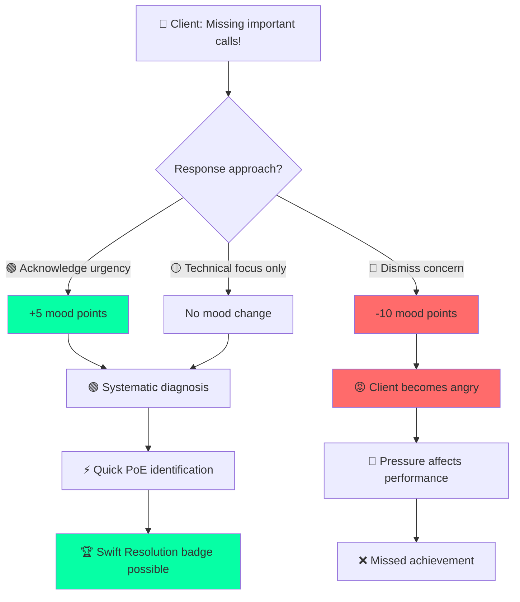
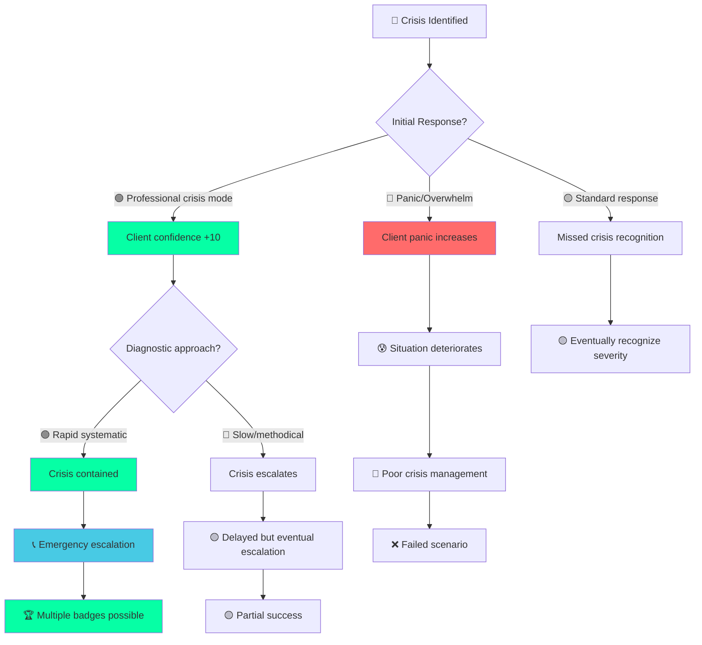
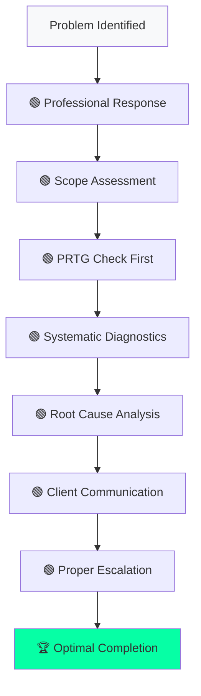

# Scenario Flow Diagrams

Visual guide to optimal troubleshooting paths for each scenario in the RTP IT Support Training Simulator.

## 🎯 How to Read These Diagrams

- **🟢 GREEN**: Optimal action/decision
- **🟡 YELLOW**: Acceptable alternative
- **🔴 RED**: Suboptimal choice (mood/score impact)
- **⚡ CRITICAL**: Key diagnostic step
- **🏆 SUCCESS**: Achievement/badge trigger
- **📞 ESCALATE**: Proper escalation point

---

## 🌐 Scenario 1: Network Outage - Cisco Core Switch

### Optimal Flow Path


### Common Mistakes to Avoid


### Score Breakdown
- **Initial Response**: 15 points
- **PRTG Check**: 20 points
- **Systematic Diagnostics**: 25 points  
- **Root Cause ID**: 30 points
- **Professional Escalation**: 25 points
- **Total Possible**: 115 points

---

## 🔐 Scenario 2: Barracuda VPN Connection Failure

### Optimal Flow Path


### Alternative Paths


### Critical Decision Points
1. **PRTG vs Client Interview**: Both valid, PRTG slightly better
2. **Backup Activation Speed**: Immediate = better score
3. **Escalation Timing**: After fixing, not before
4. **Client Communication**: Keep informed throughout

---

## 📞 Scenario 3: Mitel Phone System Outage

### Optimal Flow Path


### Time Pressure Handling


### PoE Diagnostic Sequence
1. **`show interfaces`** - Physical layer check
2. **`show poe`** - Overall PoE status ⚡
3. **`show poe interface X`** - Specific port analysis
4. **`show system`** - Overall health confirmation

---

## 🚨 Scenario 4: L3 Multi-System Cascading Failure

### Emergency Response Flow
```mermaid
graph TD
    A[🚨 EMERGENCY: Everything down!] --> B[⚡ IMMEDIATE: Acknowledge crisis]
    B --> C[🟢 Professional emergency tone]
    C --> D{Scope confirmation?}
    D --> E[🚨 200+ users, complete outage]
    E --> F[⚡ URGENT: Check PRTG status]
    F --> G[🔴 Multiple critical systems DOWN]
    G --> H[⚡ Emergency PuTTY diagnostics]
    H --> I[🟢 Run: show system (rapid)]
    I --> J[🟢 Run: show interfaces (critical)]
    J --> K[🟢 Run: netstat (connections)]
    K --> L[🔍 Cascading infrastructure failure]
    L --> M[📞 CRITICAL ESCALATION: Crisis team]
    M --> N[🟢 Emergency business continuity]
    N --> O[🏆 Badge: Crisis Manager]
    
    style A fill:#ff0000
    style B fill:#feca57
    style M fill:#48cae4
    style O fill:#06ffa5
```

### Crisis Management Decision Tree


### Emergency Command Sequence
1. **`show system`** - Immediate health overview ⚡
2. **`show interfaces`** - Critical connectivity check ⚡  
3. **`netstat`** - Active connections analysis
4. **`ping [critical-servers]`** - Infrastructure testing
5. **Emergency escalation** - Crisis team activation 📞

### Achievement Thresholds
- **🚨 Crisis Manager**: Complete within 60min, score >85
- **🆘 Emergency Responder**: Proper escalation, score >80
- **🛡️ System Savior**: Perfect path, score >90

---

## 📊 Universal Best Practices

### Optimal Decision Framework


### Score Optimization Tips
- **Response Speed**: Quick acknowledgment (+mood)
- **Tool Usage**: PRTG before PuTTY (usually optimal)
- **Command Sequence**: Logical diagnostic flow
- **Client Updates**: Keep informed throughout
- **Professional Tone**: Maintain throughout scenario
- **Escalation Timing**: After diagnosis, with findings

### Common Failure Patterns
1. **Immediate Escalation**: Skipping diagnostics (-20 points)
2. **Poor Communication**: Ignoring client mood (-15 points)
3. **Random Commands**: No systematic approach (-10 points)
4. **Missing Key Steps**: Not using critical tools (-25 points)
5. **Delayed Response**: Taking too long (-mood degradation)

---

## 🎮 Interactive Elements

### Mood Management
- **Client Stress**: Increases over time if not addressed
- **Professional Response**: Improves mood (+5 to +15 points)
- **Clear Communication**: Maintains or improves mood
- **Technical Jargon**: May confuse or frustrate client
- **Confidence**: Systematic approach builds trust

### Time Pressure
- **Network Outage**: Presentation deadline pressure
- **VPN Failure**: Remote work urgency
- **Phone System**: Missing important calls
- **L3 Emergency**: Business continuity crisis

### Tool Integration
- **PRTG → PuTTY**: Standard diagnostic flow
- **PuTTY Confirmation**: Verify PRTG findings
- **Cross-Reference**: Use both tools effectively
- **Documentation**: Note findings for escalation

---

**Remember**: Each scenario has multiple valid paths, but following the optimal flow maximizes learning value and achievement potential. Practice different approaches to understand the impact of various decision points.
